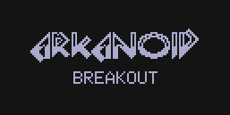
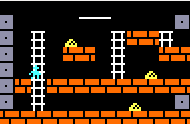
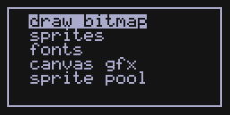
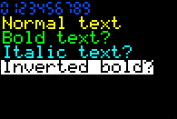

# LCDGFX — Lightweight Graphics Library for LCD/OLED Displays

[](https://travis-ci.org/lexus2k/lcdgfx)
[](https://coveralls.io/github/lexus2k/lcdgfx?branch=master)

## Introduction

LCDGFX is a lightweight C++ graphics library for driving LCD and OLED displays from
microcontrollers and embedded Linux systems. It supports monochrome, grayscale, and color
displays via I2C and SPI interfaces.

Designed for resource-constrained devices (as small as ATtiny85 with 512 bytes of RAM),
the library provides drawing primitives, text rendering, bitmap display, and a
double-buffered game engine (NanoEngine) — all while using as little flash and RAM as possible.

It can be compiled for Arduino, plain AVR (avr-gcc), ESP32 (IDF), STM32, Raspberry Pi,
and desktop (Linux/macOS/Windows via SDL2 emulation for development without hardware).

**Quick links:**
- @ref getting_started — Installation and first program
- @ref display_selection — Choose the right display class
- @ref api_overview — Architecture and API guide
- [Examples](https://github.com/lexus2k/lcdgfx/tree/master/examples) on GitHub
- [API Reference](http://lexus2k.github.io/lcdgfx) (Doxygen)

## Key Features

 * Supports color, monochrome, and grayscale OLED/LCD displays (SSD1306, SH1106, SH1107, SSD1325, SSD1327, SSD1331, SSD1351, IL9163, ST7735, ST7789, ILI9341, PCD8544)
 * Modular structure — unused modules can be excluded from compilation to reduce flash usage
 * Needs very little RAM (ATtiny85 needs ~25 bytes of RAM to communicate with OLED)
 * Fast implementation to provide reasonable speed on slow microcontrollers
 * Supports I2C and SPI interfaces:
   * I2C (software implementation, Wire library, AVR TWI, Linux i2c-dev)
   * SPI (4-wire SPI via Arduino SPI library, AVR SPI, AVR USI module)
 * Drawing primitives: lines, rectangles, circles, pixels, bitmaps
 * Text rendering with multiple font sizes (use GLCD Font Creator for custom fonts)
 * NanoCanvas for off-screen buffered drawing
 * [NanoEngine](https://github.com/lexus2k/lcdgfx/wiki/Using-NanoEngine-for-systems-with-low-resources2) — double-buffered game/animation engine with sprite support
 * Can be used for game development (bonus examples):
   * Arkanoid game ([arkanoid](../examples/games/arkanoid) in old style API and [arkanoid8](../examples/games/arkanoid8) in new style API)
   * Simple [Lode runner](../examples/games/lode_runner) game.
   * [Snowflakes](../examples/nano_engine/snowflakes)







The i2c pins can be changed via API functions. Please, refer to documentation. Keep in mind,
that the pins, which are allowed for i2c or spi interface, depend on the hardware.
The default spi SCLK and MOSI pins are defined by SPI library, and DC, RST, CES pins are configurable
through API.

## Easy to use

Example:

```.cpp
DisplayST7735_128x160x16_SPI display(3,{-1, 4, 5, 0,-1,-1});

void setup()
{
    display.begin();
    display.clear();
}

void loop()
{
    display.setColor(RGB_COLOR16(255,255,0));
    display.drawLine(10,30,56,96);
}
```

## Supported displays

| **Display** | **I2C** | **SPI** | **Orientation** | **Type** | **Colors** |
| :-------- |:---:|:---:|:---:|:---------|:---------|
| SSD1306 128x64 | ✓ | ✓ |   | OLED | Monochrome |
| SSD1306 128x32 | ✓ | ✓ |   | OLED | Monochrome |
| SH1106 128x64 | ✓ | ✓ |   | OLED | Monochrome |
| SH1107 128x64 | ✓ | ✓ |   | OLED | Monochrome |
| SH1107 64x128 | ✓ |   |   | OLED | Monochrome |
| SSD1325 128x64 | ✓ | ✓ |   | OLED | 16 grayscale |
| SSD1327 128x128 | ✓ | ✓ |   | OLED | 16 grayscale |
| SSD1331 96x64 |   | ✓ | ✓ | OLED | 64K color |
| SSD1351 128x128 |   | ✓ |   | OLED | 64K color |
| IL9163/ST7735 128x128 |   | ✓ | ✓ | TFT | 64K color |
| ST7735 128x160 |   | ✓ | ✓ | TFT | 64K color |
| ST7735 80x160 |   | ✓ | ✓ | TFT | 64K color |
| ST7789 135x240 |   | ✓ | ✓ | TFT | 64K color |
| ST7789 240x240 |   | ✓ | ✓ | TFT | 64K color |
| ST7789 170x320 |   | ✓ | ✓ | TFT | 64K color |
| ILI9341 240x320 |   | ✓ | ✓ | TFT | 64K color |
| PCD8544 84x48 |   | ✓  |   | LCD | Monochrome (Nokia 5110) |

## Supported platforms

Compilers: gcc, clang

| **Platforms** | **I2C** | **SPI** | **Comments** |
| :-------- |:---:|:---:|:---------|
| **Arduino** |     |     |          |
| ATtiny85, ATtiny45  |  ✓  |  ✓  | [Damellis attiny package](https://raw.githubusercontent.com/damellis/attiny/ide-1.6.x-boards-manager/package_damellis_attiny_index.json) |
| ATtiny84, ATtiny44  |  ✓  |  ✓  | [Damellis attiny package](https://raw.githubusercontent.com/damellis/attiny/ide-1.6.x-boards-manager/package_damellis_attiny_index.json) |
| ATmega328P, ATmega168  |  ✓  |  ✓  |    |
| ATmega32U4  |  ✓  |  ✓  |    |
| ATmega2560  |  ✓  |  ✓  |    |
| Digispark (including PRO)  |  ✓  |  ✓  |  check [compatibility list](../examples/Digispark_compatibility.txt)  |
| ESP8266  |  ✓  |  ✓  | check [compatibility list](../examples/ESP8266_compatibility.txt)   |
| ESP32  |  ✓  |  ✓  | check [compatibility list](../examples/ESP8266_compatibility.txt)   |
| STM32  |  ✓  |  ✓  | via [stm32duino](https://github.com/stm32duino/wiki/wiki)  |
| Arduino Zero | ✓  | ✓  |    |
| Nordic nRF5 (nRF51, nRF52) | ✓ | ✓ | Standard Arduino nRF52 boards, enable `-std=gnu++11` |
| Nordic nRF5 (nRF51, nRF52) | ✓ | ✓ | via [Sandeep Mistry arduino-nRF5](https://github.com/sandeepmistry/arduino-nRF5) |
| **Plain AVR** |   |     |          |
| ATtiny85, ATtiny45 |  ✓  |  ✓  |         |
| ATmega328P, ATmega168 |  ✓  |  ✓  |         |
| ATmega32U4  |  ✓  |  ✓  |    |
| **Plain ESP32** |   |     |          |
| ESP32 |  ✓  | ✓  |  library can be used as IDF component  |
| **Raspberry Pi Pico** |   |     |          |
| RP2040 |  ✓  | ✓  |  native Pico SDK support  |
| **Linux**  |    |     |          |
| Raspberry Pi |  ✓  |  ✓  | i2c-dev, spidev, libgpiod (kernel 6.6+)  |
| [SDL Emulation](https://github.com/lexus2k/lcdgfx/wiki/How-to-run-emulator-mode) |  ✓  |  ✓  | test without hardware via SDL2 |
| **macOS**  |    |     |          |
| [SDL Emulation](https://github.com/lexus2k/lcdgfx/wiki/How-to-run-emulator-mode) |  ✓  |  ✓  | test without hardware via SDL2 |
| **Windows**  |    |     |          |
| [SDL Emulation](https://github.com/lexus2k/lcdgfx/wiki/How-to-run-emulator-mode) |  ✓  |  ✓  | test without hardware via MinGW32 + SDL2 |

Digispark users: lcdgfx requires at least C++11 and C99. Check that your Digispark package
includes `-std=gnu11 -std=gnu++11` in platform.txt.

## Design Goals

 * Minimal RAM usage (runs on ATtiny85 with 512 bytes)
 * Minimal flash usage (basic I2C SSD1306 fits in ~4 KB)
 * Maximum speed on slow microcontrollers
 * [Arkanoid game](../examples/games/arkanoid) fits entirely on ATtiny85

## Setting up

*i2c Hardware setup is described [here](https://github.com/lexus2k/lcdgfx/wiki/Hardware-setup)*

*Setting up for Arduino from github sources)*
 * Download source from https://github.com/lexus2k/lcdgfx
 * Put the sources to Arduino/libraries/lcdgfx folder

*Setting up for Arduino from Arduino IDE library manager*
 * Install lcdgfx library (named lcdgfx by Alexey Dynda) via Arduino IDE library manager

*Using with plain avr-gcc:*
 * Download source from https://github.com/lexus2k/lcdgfx
 * Build the library (variant 1)
   * cd lcdgfx/src && make -f Makefile.avr MCU=<your_mcu>
   * Link library to your project (refer to [Makefile.avr](../examples/Makefile.avr) in examples folder).
 * Build demo code (variant 2)
   * cd lcdgfx/tools && ./build_and_run.sh -p avr -m <your_mcu> ssd1306_demo

 *For esp32:*
  * Download source from https://github.com/lexus2k/lcdgfx
  * Put downloaded sources to components/lcdgfx/ folder.
  * Compile your project as described in ESP-IDF build system documentation

For more information about this library, please, visit https://github.com/lexus2k/lcdgfx.
Doxygen documentation can be found at [github.io site](http://lexus2k.github.io/lcdgfx).
If you found any problem or have any idea, please, report to Issues section.

## License

The library is free. If this project helps you, you can give me a cup of coffee.

MIT License

Copyright (c) 2016-2025, Alexey Dynda

Permission is hereby granted, free of charge, to any person obtaining a copy
of this software and associated documentation files (the "Software"), to deal
in the Software without restriction, including without limitation the rights
to use, copy, modify, merge, publish, distribute, sublicense, and/or sell
copies of the Software, and to permit persons to whom the Software is
furnished to do so, subject to the following conditions:

The above copyright notice and this permission notice shall be included in all
copies or substantial portions of the Software.

THE SOFTWARE IS PROVIDED "AS IS", WITHOUT WARRANTY OF ANY KIND, EXPRESS OR
IMPLIED, INCLUDING BUT NOT LIMITED TO THE WARRANTIES OF MERCHANTABILITY,
FITNESS FOR A PARTICULAR PURPOSE AND NONINFRINGEMENT. IN NO EVENT SHALL THE
AUTHORS OR COPYRIGHT HOLDERS BE LIABLE FOR ANY CLAIM, DAMAGES OR OTHER
LIABILITY, WHETHER IN AN ACTION OF CONTRACT, TORT OR OTHERWISE, ARISING FROM,
OUT OF OR IN CONNECTION WITH THE SOFTWARE OR THE USE OR OTHER DEALINGS IN THE
SOFTWARE.
